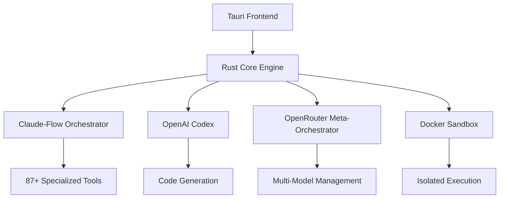

# <h1 align="center" style="font-size: 3em;">AutoDev-AI 🧠⚡</h1>

<div align="center">


[](LICENSE)
[](https://github.com/meinzeug/autodevai/releases)
[](https://www.rust-lang.org)
[](https://tauri.app)

### <h3 align="center">The Intelligent AI Development Orchestrator - Bridging Multiple AI Coding Tools into One Unified Platform</h3>

### [Features](#-features) • [Installation](#-installation) • [Quick Start](#-quick-start) • [Documentation](#-documentation) • [Contributing](#-contributing)

</div>

---

<div style="font-size: 1.1em;">

## <h2 style="font-size: 2em;">🎯 Overview</h2>

**AutoDev-AI is a revolutionary AI-powered software development platform that orchestrates multiple AI coding tools seamlessly. It solves the fragmentation problem in AI-assisted development by creating an intelligent coordination layer that manages Claude-Flow, OpenAI Codex, OpenRouter, and other AI tools without complex configuration.**


**_AutoDev-AI Neural Bridge Platform - Unified AI Development Interface_**

### <h3 style="font-size: 1.5em;">🚀 Why AutoDev-AI?</h3>

- **Zero-Configuration AI Orchestration**: Automatically coordinates multiple AI tools without complex authentication
- **Intelligent Task Routing**: Dynamically selects the best AI tool for each specific task
- **Unified Interface**: Single platform managing all your AI development assistants
- **Lightning Fast**: Built with Rust and Tauri for native performance (50-100 MB RAM, 2-5 MB binary)
- **Secure by Design**: Sandboxed execution with Docker isolation and explicit permissions

## <h2 style="font-size: 2em;">✨ Features</h2>

### <h3 style="font-size: 1.5em;">🧠 Core Capabilities</h3>

- **Multi-AI Orchestration**: Seamlessly integrates Claude-Flow, OpenAI Codex, OpenRouter, and more
- **Swarm Intelligence**: Leverages 87+ specialized AI tools working in coordination
- **Adaptive Tool Selection**: Automatically chooses the optimal AI model based on task complexity
- **Real-time Collaboration**: AI agents discuss and solve problems together
- **Zero-Friction Onboarding**: Start developing immediately without complex setup

### <h3 style="font-size: 1.5em;">⚡ Performance & Architecture</h3>

- **Native Performance**: Rust-based backend with minimal overhead
- **Asynchronous Execution**: Non-blocking operations for maximum efficiency
- **Docker Sandboxing**: Isolated project environments for security
- **Comprehensive Monitoring**: Real-time progress tracking and observability
- **Token Optimization**: Intelligent context management up to 192k tokens

### <h3 style="font-size: 1.5em;">🛠️ Development Features</h3>

- **Automated Code Generation**: Full-stack applications from natural language
- **Intelligent Refactoring**: AI-driven code improvements and optimizations
- **Test Generation**: Comprehensive test suites with high coverage
- **Documentation Creation**: Automatic API docs and code comments
- **Bug Detection**: Proactive issue identification and resolution

## <h2 style="font-size: 2em;">📦 Installation</h2>

### <h3 style="font-size: 1.5em;">Prerequisites</h3>

- **Operating System**: Windows 10+, macOS 11+, or Linux
- **Memory**: 4GB RAM minimum (8GB recommended)
- **Docker**: For sandboxed execution (optional but recommended)
- **Node.js**: Version 18+ (for development)

### <h3 style="font-size: 1.5em;">Quick Install</h3>

```bash
# Clone the repository
git clone https://github.com/meinzeug/autodevai.git
cd autodevai

# Install dependencies
npm install

# Build the application
npm run build

# Launch AutoDev-AI
npm run tauri dev
```

### <h3 style="font-size: 1.5em;">Production Build</h3>

```bash
# Create optimized production build
npm run tauri build

# The installer will be in src-tauri/target/release/bundle/
```

## <h2 style="font-size: 2em;">🚀 Quick Start</h2>

### 1. Initial Setup

```bash
# Launch AutoDev-AI
autodevai

# The platform will automatically:
# - Detect available AI tools
# - Configure optimal settings
# - Initialize the orchestration layer
```

### 2. Create Your First Project

```typescript
// Simply describe what you want to build
'Create a REST API with authentication, user management, and PostgreSQL database';

// AutoDev-AI will:
// 1. Analyze requirements
// 2. Select appropriate AI tools
// 3. Generate complete implementation
// 4. Create tests and documentation
```

### 3. AI Team Collaboration Mode

```bash
# Enable collaborative AI discussion
autodevai --team-mode

# Multiple AI agents will:
# - Discuss architecture decisions
# - Review each other's code
# - Optimize implementations
# - Ensure best practices
```

## <h2 style="font-size: 2em;">🏗️ Architecture</h2>

### System Components



### Key Technologies

| Component              | Technology      | Purpose                                  |
| ---------------------- | --------------- | ---------------------------------------- |
| **Frontend**           | Tauri + React   | Native desktop UI with web technologies  |
| **Backend**            | Rust            | High-performance orchestration engine    |
| **AI Integration**     | Claude-Flow     | Swarm intelligence and tool coordination |
| **Code Generation**    | OpenAI Codex    | Autonomous programming capabilities      |
| **Meta-Orchestration** | OpenRouter      | Multi-model AI management                |
| **Sandboxing**         | Docker          | Secure isolated execution environments   |
| **State Management**   | Redux + Zustand | Reactive UI state handling               |
| **Communication**      | WebSockets      | Real-time bidirectional updates          |

## <h2 style="font-size: 2em;">🔧 Configuration</h2>

### Basic Configuration

```json
{
  "orchestration": {
    "mode": "automatic",
    "maxConcurrentAgents": 8,
    "tokenLimit": 192000
  },
  "tools": {
    "claudeFlow": {
      "enabled": true,
      "swarmSize": "adaptive"
    },
    "openaiCodex": {
      "enabled": true,
      "model": "gpt-4-turbo"
    }
  },
  "sandboxing": {
    "docker": true,
    "isolation": "strict"
  }
}
```

### Advanced Features

#### Swarm Intelligence Configuration

```bash
# Initialize swarm topology
autodevai swarm init --topology mesh --agents 8

# Enable neural training
autodevai neural train --pattern coordination
```

#### Custom AI Tool Integration

```typescript
// Register custom AI tool
autodevai.registerTool({
  name: 'CustomAI',
  endpoint: 'https://api.custom-ai.com',
  capabilities: ['code', 'review', 'test'],
});
```

## <h2 style="font-size: 2em;">📊 Performance Benchmarks</h2>

| Metric              | AutoDev-AI  | Traditional Tools | Improvement |
| ------------------- | ----------- | ----------------- | ----------- |
| **Memory Usage**    | 50-100 MB   | 500+ MB           | 5-10x ⬇️    |
| **Startup Time**    | <2 seconds  | 10-30 seconds     | 5-15x ⬆️    |
| **Code Generation** | 192k tokens | 32k tokens        | 6x ⬆️       |
| **Task Completion** | 2.8x faster | Baseline          | 180% ⬆️     |
| **Binary Size**     | 2-5 MB      | 50-200 MB         | 10-40x ⬇️   |

## <h2 style="font-size: 2em;">🎯 Use Cases</h2>

### Full-Stack Development

- Generate complete web applications with frontend, backend, and database
- Automatic API creation with documentation
- Authentication and authorization implementation

### Microservices Architecture

- Design and implement distributed systems
- Service mesh configuration
- Inter-service communication patterns

### DevOps Automation

- CI/CD pipeline generation
- Infrastructure as Code (IaC)
- Kubernetes deployments

### Code Refactoring

- Legacy code modernization
- Performance optimization
- Technical debt reduction

## <h2 style="font-size: 2em;">🗺️ Roadmap</h2>

### Phase 1: Foundation (Current)

- ✅ Core orchestration engine
- ✅ Claude-Flow integration
- ✅ Docker sandboxing
- ✅ Basic UI implementation

### Phase 2: Enhancement

- 🔄 Additional AI tool integrations
- 🔄 Custom model training
- 🔄 Advanced collaboration features
- 🔄 Plugin ecosystem

### Phase 3: Scale

- 📋 Cloud deployment options
- 📋 Team collaboration features
- 📋 Enterprise security features
- 📋 AI model marketplace

### Phase 4: Intelligence

- 📋 Predictive development suggestions
- 📋 Autonomous project management
- 📋 Self-improving AI models
- 📋 Code quality learning

## <h2 style="font-size: 2em;">🤝 Contributing</h2>

We welcome contributions! Please see our [Contributing Guide](CONTRIBUTING.md) for details.

### Development Setup

```bash
# Fork and clone the repository
git clone https://github.com/YOUR_USERNAME/autodevai.git

# Install development dependencies
npm install --save-dev

# Run tests
npm test

# Submit PR with your improvements
```

### Production Deployment with PM2

For production deployments, you can use PM2 to manage the application with automatic restart on system boot:

```bash
# Install PM2 globally (if not already installed)
npm install -g pm2

# Start the application with PM2
pm2 start npm --name "autodevai-app" -- run tauri:dev

# Configure PM2 to start on system boot
pm2 startup

# Save the current PM2 process list
pm2 save

# Check application status
pm2 status

# View logs
pm2 logs autodevai-app

# Restart application
pm2 restart autodevai-app

# Stop application
pm2 stop autodevai-app
```

The PM2 configuration ensures:

- ✅ Automatic restart on failures
- ✅ System boot startup
- ✅ Process monitoring and logging
- ✅ Memory and CPU monitoring
- ✅ Zero-downtime deployments

### Areas for Contribution

- 🔌 AI tool integrations
- 🎨 UI/UX improvements
- 📚 Documentation
- 🧪 Test coverage
- 🐛 Bug fixes
- 🚀 Performance optimizations

## <h2 style="font-size: 2em;">📚 Documentation</h2>

- [Getting Started Guide](docs/getting-started.md)
- [Architecture Overview](docs/architecture.md)
- [API Reference](docs/api-reference.md)
- [Configuration Guide](docs/configuration.md)
- [Troubleshooting](docs/troubleshooting.md)

## <h2 style="font-size: 2em;">🔒 Security</h2>

AutoDev-AI prioritizes security:

- **Sandboxed Execution**: All code runs in isolated Docker containers
- **Explicit Permissions**: Granular control over AI tool access
- **No Credential Storage**: Zero-knowledge architecture for API keys
- **Encrypted Communication**: TLS for all external connections

## <h2 style="font-size: 2em;">📄 License</h2>

## 📜 Lizenz / License

### Dual-Lizenzmodell / Dual License Model

Dieses Projekt wird unter einem **Dual-Lizenzmodell** angeboten:

#### 🆓 GPL-3.0 Lizenz (Open Source)

- **Kostenlose Nutzung** für Open-Source-Projekte
- Jeder darf die Software frei nutzen, modifizieren und verteilen
- Alle Änderungen müssen unter GPL-3.0 veröffentlicht werden
- Ideal für persönliche, akademische und Open-Source-Projekte
- Siehe [LICENSE-GPL](LICENSE-GPL) für Details

#### 💼 Kommerzielle Lizenz (Proprietär)

- **Erforderlich für**:
  - Proprietäre/Closed-Source-Anwendungen
  - Unternehmensweite Nutzung
  - Kommerzielle Produkte ohne GPL-Verpflichtungen
  - Software-as-a-Service (SaaS) Angebote
- **Vorteile**:
  - Keine Copyleft-Verpflichtungen
  - Proprietäre Modifikationen erlaubt
  - Kommerzieller Support verfügbar
  - Erweiterte Features und Prioritäts-Updates
- **Kontakt**: Für kommerzielle Lizenzen kontaktieren Sie bitte [meinzeug@example.com](mailto:meinzeug@example.com)

### ⚖️ Welche Lizenz benötigen Sie?

| Nutzungsart           | Erforderliche Lizenz |
| --------------------- | -------------------- |
| Persönliche Projekte  | GPL-3.0 (kostenlos)  |
| Open-Source-Projekte  | GPL-3.0 (kostenlos)  |
| Akademische Forschung | GPL-3.0 (kostenlos)  |
| Proprietäre Software  | Kommerzielle Lizenz  |
| Unternehmenseinsatz   | Kommerzielle Lizenz  |
| SaaS-Anwendungen      | Kommerzielle Lizenz  |
| Weiterverkauf         | Kommerzielle Lizenz  |

### 📝 Hinweis

Durch die Nutzung dieser Software akzeptieren Sie die Bedingungen der gewählten Lizenz. Bei Unsicherheiten bezüglich der Lizenzwahl kontaktieren Sie uns bitte.

## <h2 style="font-size: 2em;">🙏 Acknowledgments</h2>

- [Tauri](https://tauri.app) - For the amazing Rust framework
- [Claude-Flow](https://github.com/ruvnet/claude-flow) - For swarm intelligence capabilities
- [OpenAI](https://openai.com) - For Codex and GPT models
- [Docker](https://docker.com) - For containerization technology

## <h2 style="font-size: 2em;">💬 Support & Community</h2>

- **GitHub Issues**: [Report bugs or request features](https://github.com/meinzeug/autodevai/issues)
- **Discussions**: [Join the conversation](https://github.com/meinzeug/autodevai/discussions)
- **Discord**: [Community chat](https://discord.gg/autodevai) (Coming soon)
- **Twitter**: [@autodevai](https://twitter.com/autodevai) (Coming soon)

## <h2 style="font-size: 2em;">🌟 Star History</h2>

[](https://star-history.com/#meinzeug/autodevai&Date)

---

<div align="center">

**Built with ❤️ by the AutoDev-AI Team**

[Website](https://autodevai.com) • [Documentation](https://docs.autodevai.com) • [Blog](https://blog.autodevai.com)

</div>

</div>
