# AutoDev-AI Component Diagrams

## C4 Model Architecture

### Level 1: System Context Diagram

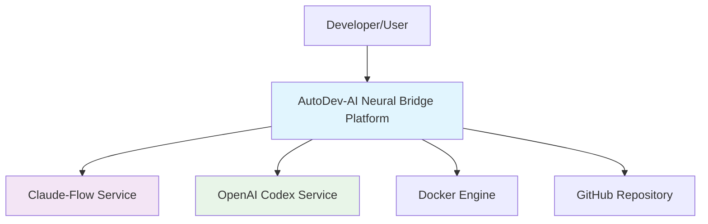

### Level 2: Container Diagram

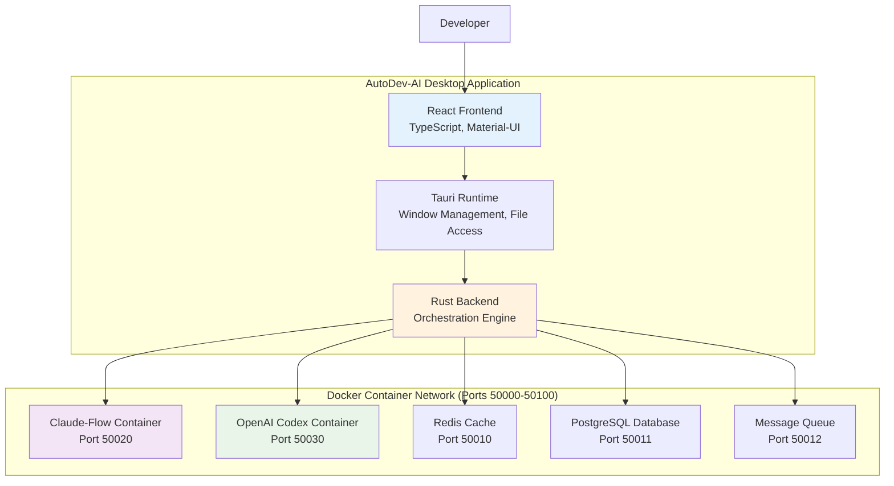

### Level 3: Component Diagram - Backend Services

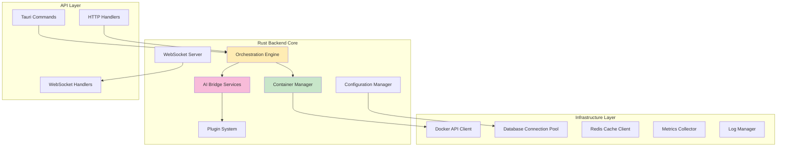

### Level 4: Code Level Diagram - Orchestration Engine

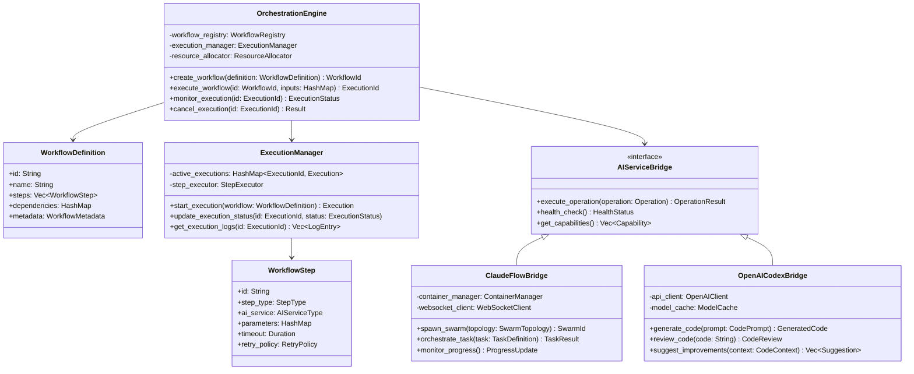

## Data Flow Diagrams

### Workflow Execution Flow

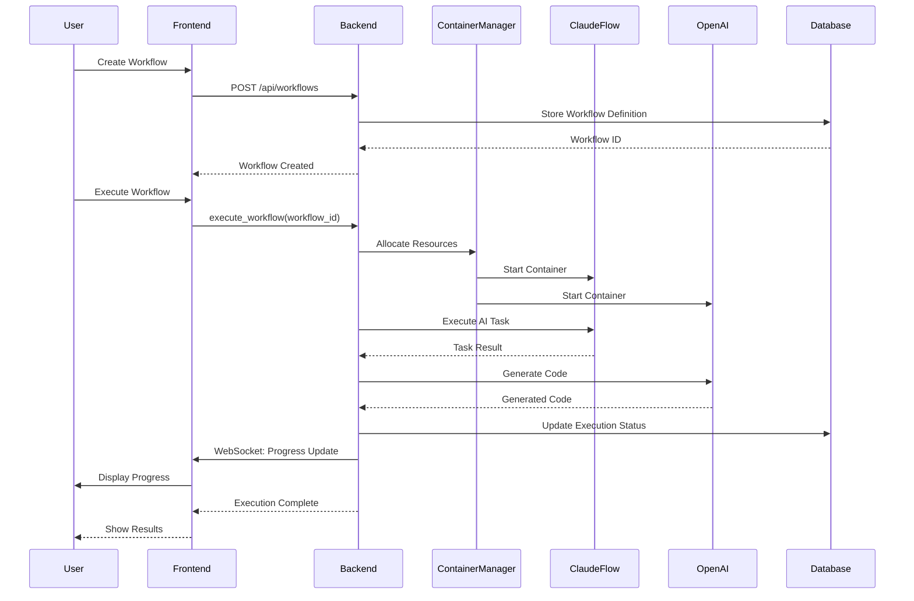

### Container Lifecycle Management

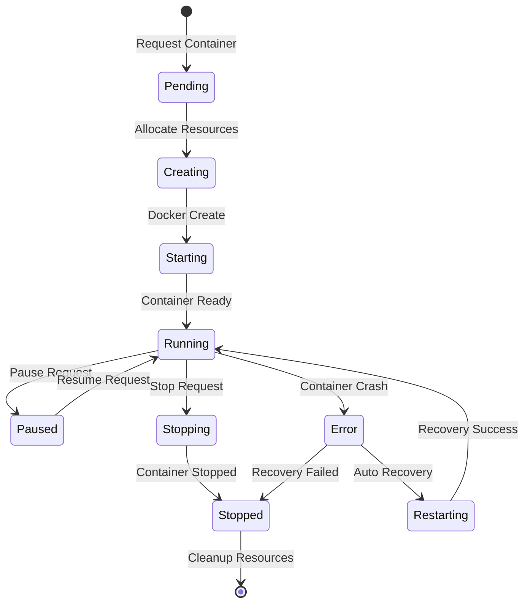

### AI Service Integration Flow

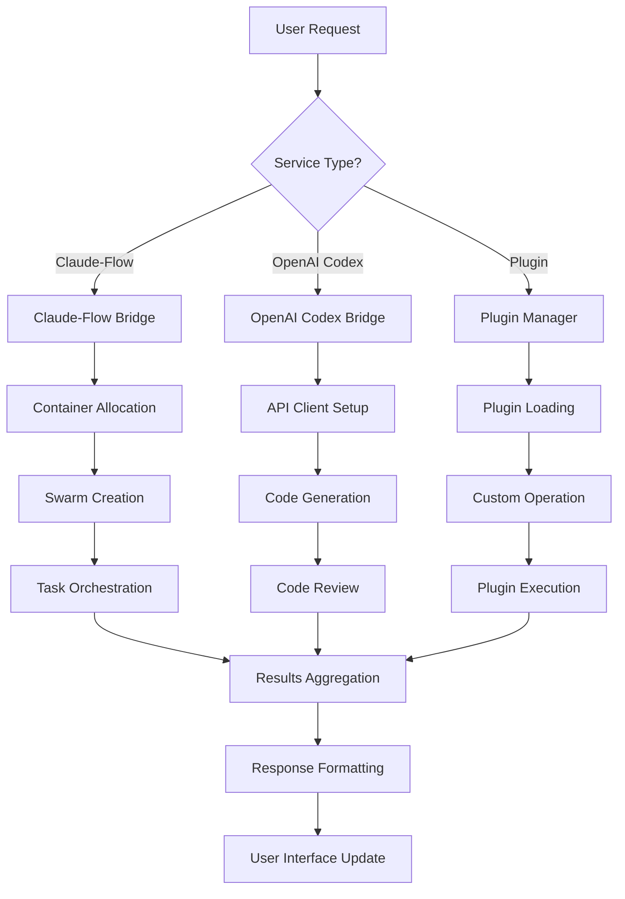

## Component Interaction Patterns

### Plugin Architecture Pattern

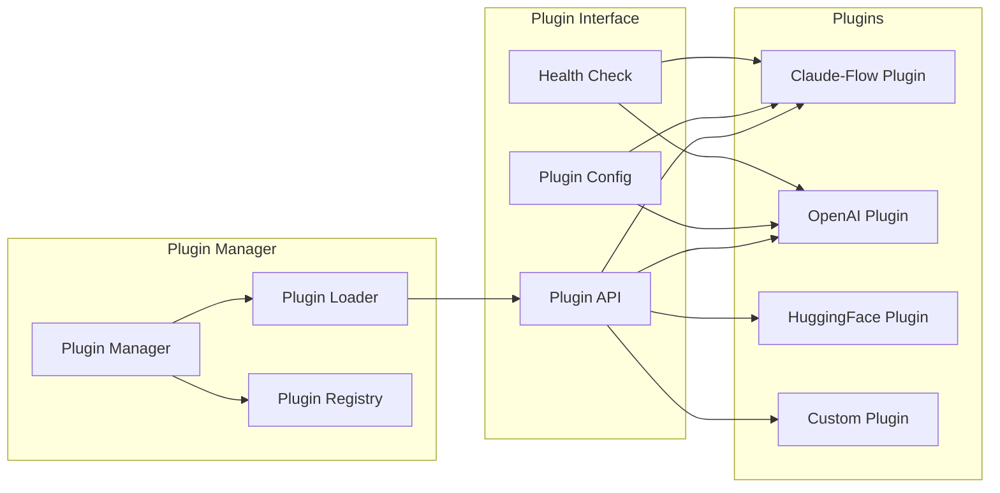

### Event-Driven Architecture

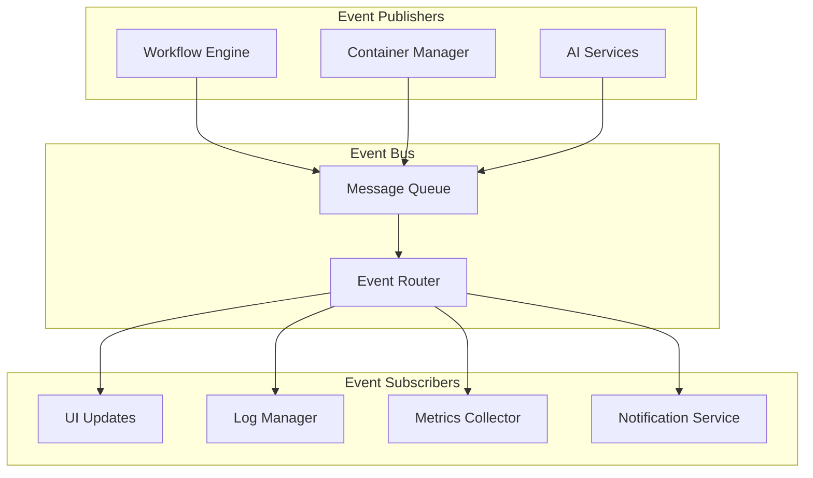

## Security Component Diagram

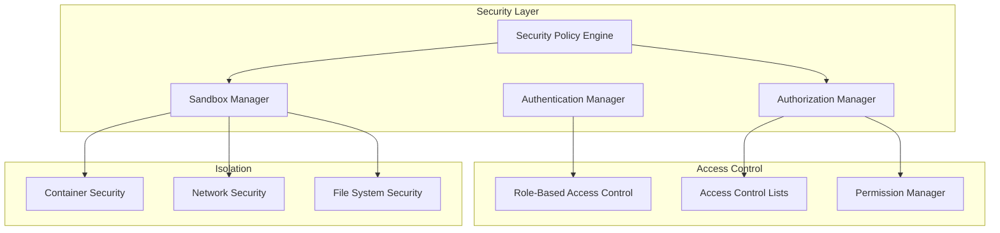

## Performance Monitoring Components

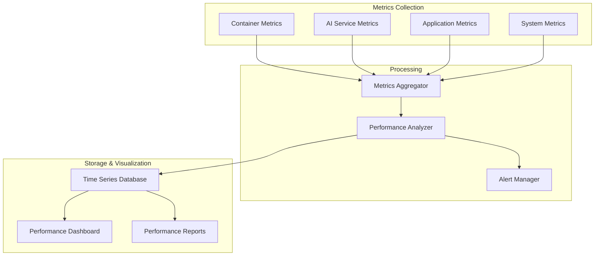

## Network Architecture Diagram

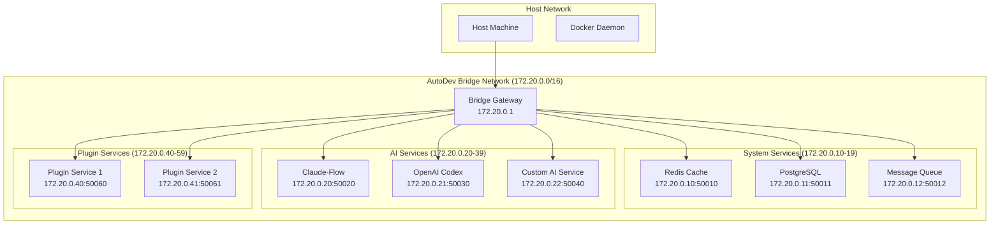

## Deployment Component Diagram

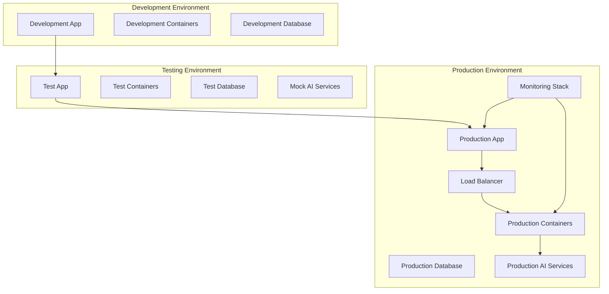

These component diagrams provide a comprehensive view of the AutoDev-AI Neural Bridge Platform architecture, showing how all components interact at different levels of abstraction. The diagrams follow the C4 model for clear architectural communication and include detailed views of data flow, security, performance monitoring, and deployment patterns.