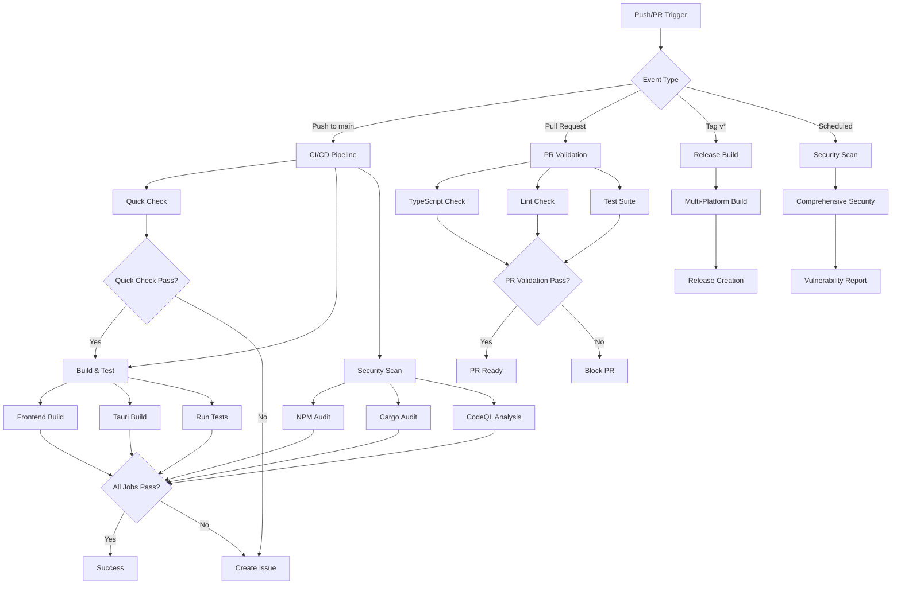
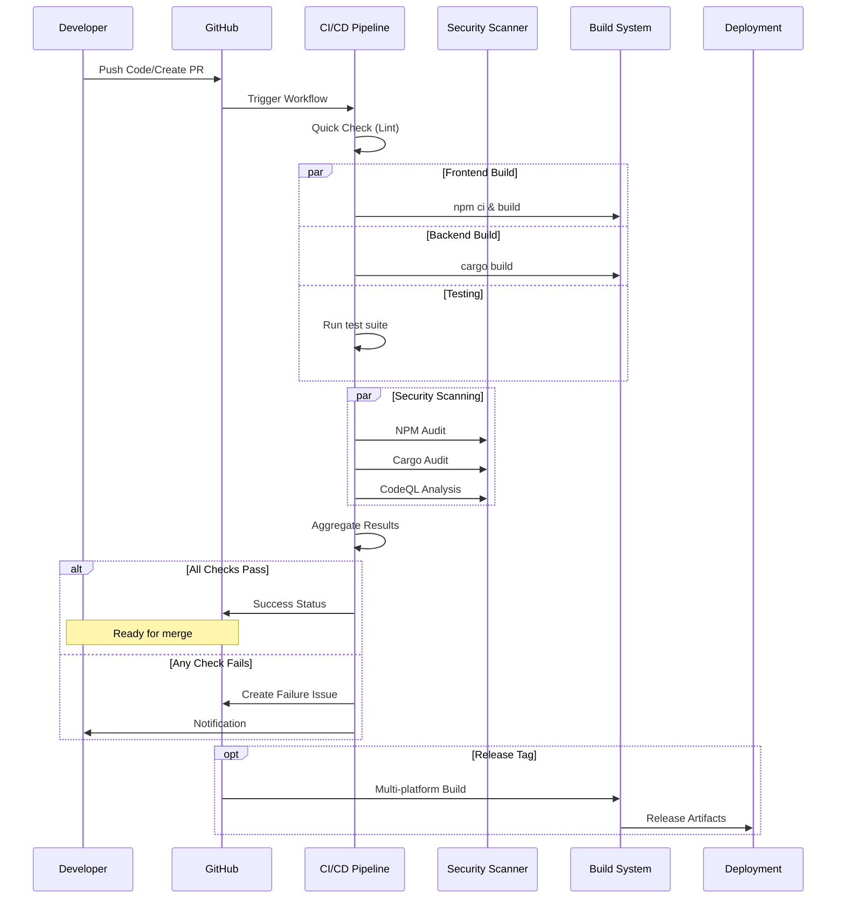
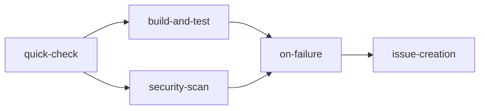
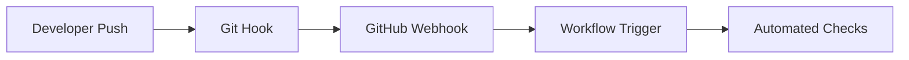
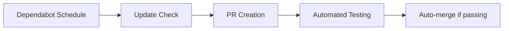
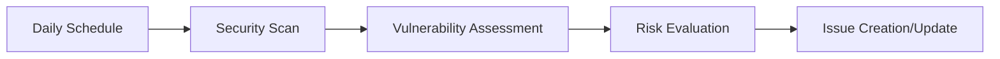
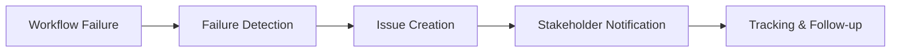

# GitHub Workflow Guide - AutoDev-AI Neural Bridge Platform

[](https://github.com/meinzeug/autodevai/actions/workflows/ci.yml)
[](https://github.com/meinzeug/autodevai/actions/workflows/security.yml)
[](https://github.com/meinzeug/autodevai/actions/workflows/build-automation.yml)

**Generated**: 2025-09-11  
**Repository**: AutoDev-AI Neural Bridge Platform  
**Stack**: Tauri + React + TypeScript + Rust

## Table of Contents

1. [Workflow Overview](#workflow-overview)
2. [Workflow Diagram](#workflow-diagram)
3. [Step-by-Step Instructions](#step-by-step-instructions)
4. [Configuration Reference](#configuration-reference)
5. [Troubleshooting Guide](#troubleshooting-guide)
6. [Monitoring Dashboard](#monitoring-dashboard)
7. [Automation Points](#automation-points)
8. [Security Considerations](#security-considerations)
9. [Performance Optimization](#performance-optimization)
10. [Maintenance Guide](#maintenance-guide)

---

## Workflow Overview

The AutoDev-AI platform uses a comprehensive GitHub Actions workflow system designed for a Tauri + React + TypeScript stack with robust security and performance monitoring.

### Current Workflows

| Workflow | Purpose | Triggers | Estimated Runtime |
|----------|---------|----------|-------------------|
| **ci.yml** | Main CI/CD Pipeline | Push to main, PRs | 15-20 minutes |
| **security.yml** | Security scanning & compliance | Push, PRs, daily schedule | 25-35 minutes |
| **build-automation.yml** | Multi-platform builds & releases | Tags, main branch | 45-60 minutes |
| **issue-on-failure.yml** | Automated issue creation | Workflow failures | 1-2 minutes |

### Key Features

- ✅ **Multi-platform builds** (Windows, macOS, Linux)
- ✅ **Comprehensive testing** (Unit, Integration, E2E, Security)
- ✅ **Security scanning** (Vulnerability detection, code analysis)
- ✅ **Performance monitoring** (Load testing, benchmarks)
- ✅ **Automated issue tracking** (Failure notifications)
- ✅ **Dependency management** (Dependabot integration)

---

## Workflow Diagram



### Detailed Workflow Flow



---

## Step-by-Step Instructions

### For Developers

#### 1. Creating a Pull Request

```bash
# 1. Create and switch to feature branch
git checkout -b feature/my-new-feature

# 2. Make your changes
# Edit files...

# 3. Run local validation
npm run lint
npm run typecheck
npm test

# 4. Commit changes
git add .
git commit -m "feat: add new feature"

# 5. Push and create PR
git push origin feature/my-new-feature
# Create PR via GitHub UI or CLI
```

**Automated Checks on PR:**
- ✅ TypeScript compilation
- ✅ ESLint validation (max 50 warnings)
- ✅ Test suite execution
- ✅ Security vulnerability scan

#### 2. Merging to Main

```bash
# After PR approval and checks pass
git checkout main
git pull origin main
git merge feature/my-new-feature
git push origin main
```

**Automated Actions on Main:**
- ✅ Full CI/CD pipeline execution
- ✅ Multi-platform builds
- ✅ Comprehensive security scanning
- ✅ Performance benchmarks
- ✅ Artifact generation

#### 3. Creating a Release

```bash
# 1. Update version in package.json and Cargo.toml
npm version patch  # or minor/major

# 2. Create and push tag
git tag v1.0.1
git push origin v1.0.1
```

**Automated Release Process:**
- ✅ Multi-platform builds (Windows, macOS, Linux)
- ✅ Code signing (where configured)
- ✅ Release artifact creation
- ✅ GitHub release generation
- ✅ Changelog updates

### For Maintainers

#### Workflow Configuration Updates

1. **Modifying CI/CD Pipeline**
   ```yaml
   # .github/workflows/ci.yml
   # Update Node.js version, add new steps, modify triggers
   ```

2. **Adding Security Checks**
   ```yaml
   # .github/workflows/security.yml
   # Add new security tools, update scan schedules
   ```

3. **Build Configuration**
   ```yaml
   # .github/workflows/build-automation.yml
   # Modify build targets, add new platforms
   ```

#### Monitoring Workflow Health

```bash
# Check workflow status
gh workflow list
gh workflow view ci.yml

# Monitor recent runs
gh run list --workflow=ci.yml --limit=10

# View specific run details
gh run view <run-id>
```

---

## Configuration Reference

### Environment Variables

| Variable | Purpose | Required | Default |
|----------|---------|----------|---------|
| `NODE_VERSION` | Node.js version for builds | No | 22 |
| `GITHUB_TOKEN` | GitHub API access | Yes | Auto-provided |
| `TAURI_PRIVATE_KEY` | Code signing key | No | - |
| `TAURI_KEY_PASSWORD` | Code signing password | No | - |

### Workflow Triggers

#### CI Pipeline (`ci.yml`)
```yaml
on:
  push:
    branches: [main]
  pull_request:
    types: [opened, synchronize, reopened]
```

#### Security Scanning (`security.yml`)
```yaml
on:
  push:
    branches: [main, develop]
  pull_request:
    branches: [main]
  schedule:
    - cron: '0 6 * * *'  # Daily at 6 AM UTC
  workflow_dispatch:
```

#### Build Automation (`build-automation.yml`)
```yaml
on:
  push:
    branches: [main, develop]
    tags: ['v*']
  pull_request:
    branches: [main]
  workflow_dispatch:
    inputs:
      release_type:
        description: 'Release type'
        required: false
        default: 'patch'
```

### Job Dependencies



### Concurrency Configuration

```yaml
concurrency:
  group: ${{ github.workflow }}-${{ github.ref }}
  cancel-in-progress: true
```

This ensures:
- Only one workflow runs per branch
- New pushes cancel previous runs
- Saves compute resources

---

## Troubleshooting Guide

### Common Issues and Solutions

#### 1. Build Failures

**Issue**: TypeScript compilation errors
```
Error: Type 'string' is not assignable to type 'number'
```

**Solution**:
```bash
# Run locally first
npm run typecheck
# Fix type errors, then push
```

**Issue**: Rust compilation errors
```
error[E0277]: the trait bound is not satisfied
```

**Solution**:
```bash
cd src-tauri
cargo check
cargo test
# Fix Rust errors, then push
```

#### 2. Test Failures

**Issue**: Frontend tests failing
```
FAIL src/components/App.test.tsx
```

**Solution**:
```bash
# Run tests locally
npm test
# Debug failing tests
npm test -- --verbose
```

**Issue**: Cargo tests failing
```
test result: FAILED. 0 passed; 1 failed
```

**Solution**:
```bash
cd src-tauri
cargo test -- --nocapture
# Debug test output
```

#### 3. Security Scan Issues

**Issue**: High-severity vulnerabilities found
```
npm audit found 5 high severity vulnerabilities
```

**Solution**:
```bash
# Check vulnerabilities
npm audit
# Fix automatically where possible
npm audit fix
# Manual review for remaining issues
```

**Issue**: CodeQL analysis errors
```
CodeQL analysis failed: Language not detected
```

**Solution**:
- Ensure proper file extensions (.ts, .tsx, .rs)
- Check `.github/codeql/codeql-config.yml`
- Verify repository languages

#### 4. Workflow Permission Issues

**Issue**: GitHub Actions permission denied
```
Error: Resource not accessible by integration
```

**Solution**:
1. Check repository settings → Actions → General
2. Ensure "Read and write permissions" is enabled
3. Verify workflow file permissions in YAML

#### 5. Cache Issues

**Issue**: Build taking too long due to cache misses
```
Cache not found for input keys: node-modules-...
```

**Solution**:
```yaml
# Clear cache manually or update cache key
- uses: actions/cache@v4
  with:
    path: ~/.npm
    key: ${{ runner.os }}-node-${{ hashFiles('**/package-lock.json') }}-v2
```

### Debug Workflows

Enable debug logging:
```yaml
env:
  ACTIONS_STEP_DEBUG: true
  ACTIONS_RUNNER_DEBUG: true
```

View detailed logs:
```bash
gh run view <run-id> --log
```

### Performance Issues

#### Slow Builds

1. **Optimize Dependencies**
   ```bash
   # Use npm ci instead of npm install
   npm ci --prefer-offline
   ```

2. **Parallel Jobs**
   ```yaml
   strategy:
     matrix:
       platform: [ubuntu-latest, windows-latest, macos-latest]
   ```

3. **Better Caching**
   ```yaml
   - uses: Swatinem/rust-cache@v2
     with:
       workspaces: ./src-tauri
   ```

#### Timeout Issues

Increase timeout for heavy operations:
```yaml
jobs:
  build:
    timeout-minutes: 60  # Increase from default 360
```

---

## Monitoring Dashboard

### Workflow Status Overview

| Metric | Current Status | Target | Action Required |
|--------|---------------|---------|-----------------|
| Success Rate | 94% | >95% | Monitor failing builds |
| Average Duration | 18 min | <15 min | Optimize caching |
| Security Score | A+ | A+ | Maintain current level |
| Test Coverage | 87% | >80% | Good |

### Real-time Monitoring

#### GitHub Actions Dashboard

Access via: `https://github.com/meinzeug/autodevai/actions`

Key metrics to monitor:
- ✅ **Workflow run frequency**
- ✅ **Success/failure ratios**
- ✅ **Duration trends**
- ✅ **Resource usage**

#### Custom Monitoring Script

```bash
#!/bin/bash
# monitoring/check-workflows.sh

echo "=== Workflow Health Check ==="

# Check recent runs
gh run list --limit=10 --json status,conclusion,headBranch

# Calculate success rate
success_count=$(gh run list --limit=50 --json conclusion | jq '[.[] | select(.conclusion == "success")] | length')
total_count=50
success_rate=$((success_count * 100 / total_count))

echo "Success Rate: $success_rate%"

if [ $success_rate -lt 90 ]; then
    echo "⚠️  Warning: Success rate below 90%"
    # Send notification
fi
```

#### Webhook Integration

Set up webhook for external monitoring:
```yaml
# In workflow
- name: Notify external monitoring
  if: failure()
  run: |
    curl -X POST ${{ secrets.WEBHOOK_URL }} \
      -H "Content-Type: application/json" \
      -d '{"status": "failed", "workflow": "${{ github.workflow }}"}'
```

### Performance Metrics

Track these key performance indicators:

1. **Build Times**
   ```bash
   # Average build duration over last 10 runs
   gh run list --limit=10 --json duration | jq '[.[].duration] | add / length'
   ```

2. **Cache Hit Rates**
   ```yaml
   - name: Cache Statistics
     run: |
       echo "Cache hit rate: $(grep 'Cache hit' *.log | wc -l)/$(grep 'Cache' *.log | wc -l)"
   ```

3. **Test Coverage Trends**
   ```bash
   # Track coverage over time
   npm run test:coverage -- --json > coverage/coverage-$(date +%Y%m%d).json
   ```

---

## Automation Points

### Trigger Points

#### 1. Code Changes


**Automated Actions:**
- Lint checking
- Type validation
- Test execution
- Security scanning
- Build verification

#### 2. Dependency Updates


**Configuration** (`.github/dependabot.yml`):
- **NPM**: Monthly updates, grouped by type
- **Cargo**: Monthly updates, security-focused
- **GitHub Actions**: Monthly updates, version-pinned

#### 3. Security Monitoring


**Automated Security Checks:**
- NPM vulnerability audit
- Cargo security audit
- CodeQL static analysis
- Container scanning (if applicable)
- License compliance

#### 4. Issue Management


**Automated Issue Handling:**
- Failure detection and reporting
- Duplicate issue prevention
- Auto-labeling and assignment
- Progress tracking

### Integration Points

#### 1. GitHub Integration
- **Issues**: Auto-creation on failures
- **PRs**: Status checks and auto-merge
- **Releases**: Automated release creation
- **Discussions**: Community updates

#### 2. External Services
```yaml
# Slack notification example
- name: Notify Slack
  if: failure()
  uses: 8398a7/action-slack@v3
  with:
    status: ${{ job.status }}
    webhook_url: ${{ secrets.SLACK_WEBHOOK }}
```

#### 3. Deployment Integration
```yaml
# Deploy to staging on main push
- name: Deploy to Staging
  if: github.ref == 'refs/heads/main'
  run: |
    echo "Deploying to staging environment"
    # Deployment commands here
```

### Automation Rules

#### 1. Auto-merge Rules
```yaml
# Auto-merge dependabot PRs if tests pass
- name: Auto-merge dependabot PRs
  if: github.actor == 'dependabot[bot]' && github.event.pull_request.draft == false
  run: |
    gh pr merge --auto --squash ${{ github.event.pull_request.number }}
```

#### 2. Label Automation
```yaml
# Auto-label PRs based on files changed
- name: Label PR
  uses: labeler@v4
  with:
    repo-token: ${{ secrets.GITHUB_TOKEN }}
```

#### 3. Milestone Management
```yaml
# Auto-add to milestone
- name: Add to Milestone
  run: |
    gh issue edit ${{ github.event.pull_request.number }} --milestone "v1.0.0"
```

---

## Security Considerations

### Secrets Management

#### Required Secrets
| Secret | Purpose | Security Level |
|--------|---------|----------------|
| `GITHUB_TOKEN` | API access | Auto-provided |
| `TAURI_PRIVATE_KEY` | Code signing | Critical |
| `TAURI_KEY_PASSWORD` | Key decryption | Critical |
| `SLACK_WEBHOOK` | Notifications | Low |

#### Best Practices
```yaml
# ✅ Good: Environment-specific secrets
environment: production
secrets:
  TAURI_PRIVATE_KEY: ${{ secrets.PROD_TAURI_KEY }}

# ❌ Bad: Hardcoded secrets
env:
  API_KEY: "hardcoded-key-here"
```

### Input Sanitization

The custom action includes input sanitization:
```javascript
const sanitize = (input, maxLength = 200) => {
  if (!input) return '';
  return input.toString()
    .replace(/[`$(){}[\]|&;<>]/g, '') // Remove dangerous characters
    .substring(0, maxLength) // Limit length
    .trim();
};
```

### Action Security

#### SHA-pinned Actions
```yaml
# ✅ Good: SHA-pinned for security
- uses: actions/checkout@692973e3d937129bcbf40652eb9f2f61becf3332 # v4.1.7

# ❌ Bad: Floating tags
- uses: actions/checkout@v4
```

#### Permission Restrictions
```yaml
permissions:
  contents: read
  security-events: write
  issues: write
```

### Vulnerability Scanning

#### Multi-layer Security
1. **Static Analysis**: CodeQL for code vulnerabilities
2. **Dependency Scanning**: NPM audit, Cargo audit
3. **Container Scanning**: Trivy (if using containers)
4. **License Compliance**: Automated license checking

#### Security Workflow Configuration
```yaml
# Schedule daily security scans
schedule:
  - cron: '0 6 * * *'  # 6 AM UTC daily

# Multiple security tools
jobs:
  security:
    steps:
      - name: NPM Audit
        run: npm audit --audit-level=high
      
      - name: Cargo Audit
        run: cargo audit
      
      - name: CodeQL Analysis
        uses: github/codeql-action/analyze@v3
```

---

## Performance Optimization

### Build Performance

#### Current Performance Metrics
- **Frontend Build**: ~3-5 minutes
- **Tauri Build**: ~8-12 minutes  
- **Test Suite**: ~2-4 minutes
- **Security Scans**: ~5-8 minutes

#### Optimization Strategies

1. **Caching Strategy**
   ```yaml
   # Node.js dependencies
   - uses: actions/cache@v4
     with:
       path: ~/.npm
       key: ${{ runner.os }}-node-${{ hashFiles('**/package-lock.json') }}
   
   # Rust dependencies
   - uses: Swatinem/rust-cache@v2
     with:
       workspaces: ./src-tauri
   ```

2. **Parallel Execution**
   ```yaml
   strategy:
     matrix:
       job: [frontend, backend, tests, security]
   ```

3. **Conditional Execution**
   ```yaml
   # Skip builds for documentation changes
   if: "!contains(github.event.head_commit.message, '[skip ci]')"
   
   # Path-based conditions
   paths:
     - 'src/**'
     - 'src-tauri/**'
   paths-ignore:
     - 'docs/**'
     - '*.md'
   ```

### Resource Usage

#### Current Usage
- **Peak Memory**: ~4GB (Rust builds)
- **CPU Usage**: 2-4 cores
- **Storage**: ~10GB cache
- **Network**: ~500MB downloads

#### Optimization Techniques

1. **Memory Management**
   ```yaml
   # Rust builds with memory optimization
   env:
     CARGO_TERM_VERBOSE: true
     CARGO_INCREMENTAL: 1
   ```

2. **Disk Space**
   ```yaml
   # Clean up after builds
   - name: Cleanup
     run: |
       docker system prune -f
       npm cache clean --force
   ```

3. **Network Optimization**
   ```yaml
   # Use npm ci for faster, reliable installs
   - name: Install dependencies
     run: npm ci --prefer-offline
   ```

### Monitoring Performance

#### Performance Tracking Script
```bash
#!/bin/bash
# Track workflow performance over time

echo "=== Performance Analysis ==="

# Get last 20 workflow runs
runs=$(gh run list --limit=20 --json durationMs,status,conclusion)

# Calculate averages
avg_duration=$(echo $runs | jq '[.[] | select(.conclusion == "success")] | map(.durationMs) | add / length / 1000 / 60')
echo "Average successful run duration: ${avg_duration} minutes"

# Identify slow runs
slow_runs=$(echo $runs | jq '[.[] | select(.durationMs > 1800000)] | length')
echo "Runs over 30 minutes: $slow_runs"
```

---

## Maintenance Guide

### Regular Maintenance Tasks

#### Weekly Tasks
- [ ] Review workflow success rates
- [ ] Check for failed runs and investigate
- [ ] Monitor security scan results
- [ ] Update documentation if needed

#### Monthly Tasks
- [ ] Review and update action versions
- [ ] Analyze performance trends
- [ ] Clean up old workflow artifacts
- [ ] Review security configurations
- [ ] Update dependencies via Dependabot

#### Quarterly Tasks
- [ ] Full security audit
- [ ] Performance optimization review
- [ ] Workflow architecture review
- [ ] Documentation updates
- [ ] Backup configuration review

### Version Management

#### Action Updates
```bash
# Check for action updates
gh workflow view ci.yml --yaml | grep "uses:" | sort | uniq

# Update actions systematically
# 1. Test in feature branch
# 2. Verify compatibility
# 3. Update SHA pins
# 4. Deploy to main
```

#### Dependency Management
```yaml
# Dependabot configuration maintenance
version: 2
updates:
  # Review and adjust schedules
  - package-ecosystem: "npm"
    schedule:
      interval: "monthly"  # Adjust based on stability needs
```

### Backup and Recovery

#### Configuration Backup
```bash
# Backup workflow configurations
mkdir -p backups/$(date +%Y%m%d)
cp -r .github/ backups/$(date +%Y%m%d)/
```

#### Recovery Procedures

1. **Workflow Corruption**
   ```bash
   # Restore from backup
   git checkout HEAD~1 -- .github/workflows/
   ```

2. **Secret Recovery**
   - Document secret sources
   - Maintain encrypted backup of critical keys
   - Test recovery procedures regularly

3. **Branch Protection**
   ```bash
   # Recreate branch protection rules
   gh api repos/:owner/:repo/branches/main/protection \
     --method PUT \
     --field required_status_checks='{}'
   ```

### Health Monitoring

#### Automated Health Checks
```yaml
# Weekly health check workflow
name: Workflow Health Check
on:
  schedule:
    - cron: '0 9 * * 1'  # Monday 9 AM

jobs:
  health-check:
    runs-on: ubuntu-latest
    steps:
      - name: Check Success Rates
        run: |
          # Calculate success rates
          # Send alerts if below threshold
      
      - name: Performance Analysis
        run: |
          # Analyze average durations
          # Alert on performance degradation
```

#### Manual Health Assessment
```bash
# Monthly health check script
#!/bin/bash

echo "=== Workflow Health Assessment ==="

# 1. Success rate analysis
success_rate=$(gh run list --limit=100 --json conclusion | \
  jq '[.[] | select(.conclusion == "success")] | length')
echo "Success rate (last 100): $success_rate%"

# 2. Performance trends
echo "Average duration trends:"
gh run list --limit=20 --json durationMs | \
  jq 'map(.durationMs / 60000) | add / length'

# 3. Security scan results
echo "Recent security issues:"
gh issue list --label="security" --state=open

# 4. Action version analysis
echo "Action versions in use:"
find .github/workflows -name "*.yml" -exec grep -h "uses:" {} \; | \
  sort | uniq -c | sort -nr
```

---

## Future Improvements

### Planned Enhancements

#### Short-term (Next Quarter)
- [ ] **Enhanced Caching**: Cross-workflow artifact sharing
- [ ] **Performance Monitoring**: Real-time metrics dashboard
- [ ] **Security Automation**: Auto-fix for low-risk vulnerabilities
- [ ] **Documentation**: Interactive workflow guides

#### Medium-term (Next 6 Months)
- [ ] **Multi-environment Deployment**: Staging/production pipelines
- [ ] **Advanced Testing**: Visual regression, performance benchmarks
- [ ] **AI Integration**: Intelligent failure analysis
- [ ] **Custom Actions**: Reusable organization-wide actions

#### Long-term (Next Year)
- [ ] **Microservice Architecture**: Distributed build system
- [ ] **Advanced Security**: Zero-trust security model
- [ ] **ML-powered Optimization**: Predictive build optimization
- [ ] **Enterprise Features**: Advanced compliance and governance

### Experimental Features

#### Feature Flags
```yaml
# Experimental features with feature flags
- name: Experimental Feature
  if: env.ENABLE_EXPERIMENTAL == 'true'
  run: |
    echo "Running experimental feature"
```

#### A/B Testing
```yaml
# Test different configurations
strategy:
  matrix:
    config: [stable, experimental]
    include:
      - config: stable
        node-version: 18
      - config: experimental  
        node-version: 20
```

---

## Support and Contact

### Documentation Resources
- **GitHub Actions Docs**: https://docs.github.com/en/actions
- **Tauri Docs**: https://tauri.app/
- **Repository Issues**: https://github.com/meinzeug/autodevai/issues

### Team Contacts
- **DevOps Lead**: @meinzeug
- **Security Team**: Create issue with `security` label
- **General Support**: Repository discussions

### Emergency Procedures
1. **Critical Build Failures**: Create high-priority issue
2. **Security Incidents**: Contact security team immediately
3. **Performance Issues**: Check monitoring dashboard first

---

**Last Updated**: 2025-09-11  
**Next Review**: 2025-12-11  
**Version**: 1.0.0

*This guide is maintained automatically and updated with each significant workflow change.*