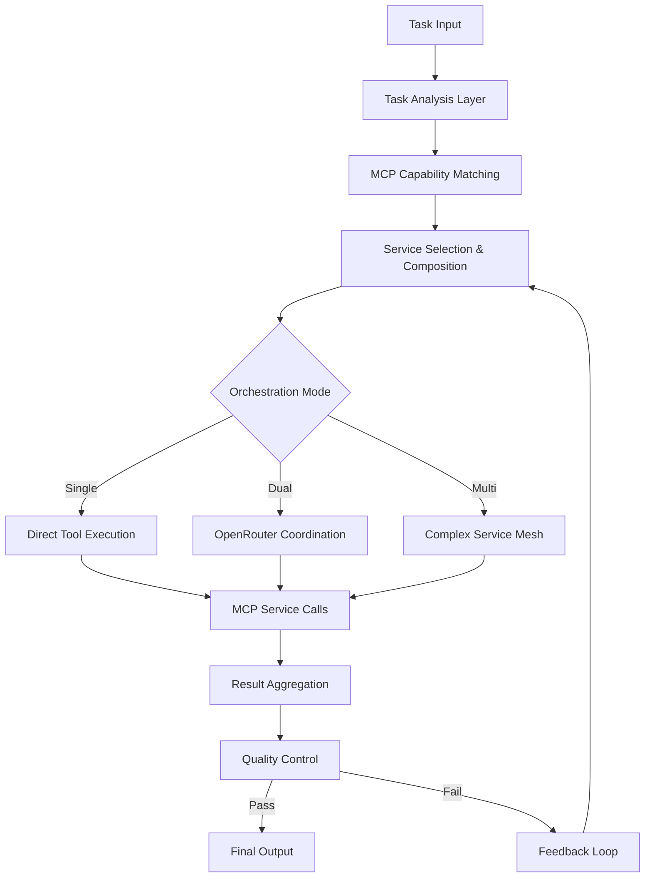

# AutoDev-AI Neural Bridge Platform
## Das ultimative Implementierungskonzept mit MCP Server Integration

### Repository: https://github.com/meinzeug/autodevai

---

## 🌟 Executive Summary

**AutoDev-AI Neural Bridge** revolutioniert die AI-gesteuerte Softwareentwicklung durch die Verschmelzung zweier paradigmenwechselnder Konzepte:

1. **Zero-Configuration AI Orchestration**: Intelligente Koordination bereits installierter AI-Tools ohne eigene Authentifizierung
2. **Model Context Protocol (MCP) Integration**: Selbstorganisierende Service-Mesh-Architektur für universelle Tool-Interoperabilität

Die Synergie dieser Ansätze schafft ein System, das gleichzeitig einfach zu nutzen und unendlich erweiterbar ist - ein selbstevolvierendes Ökosystem für AI-gesteuerte Entwicklung.

---

## 📖 Visionäre Projektbeschreibung

### Die duale Revolution: Zero-Config trifft MCP

Die moderne Softwareentwicklung steht vor zwei fundamentalen Herausforderungen:

**Herausforderung 1: Tool-Isolation**
Revolutionäre AI-Tools wie Claude-Flow (mit 87+ spezialisierten Tools und Swarm Intelligence) und OpenAI Codex (mit 192k Token Kontext und autonomer Execution) existieren, arbeiten aber isoliert. Es ist, als hätte man die brillantesten Experten der Welt, die nicht miteinander kommunizieren können.

**Herausforderung 2: Integrations-Komplexität**
Traditionelle Integrationsansätze erfordern API-Key-Management, OAuth-Flows, und komplexe Authentifizierung. Jedes neue Tool bedeutet wochen- oder monatelange Integrationsarbeit.

**AutoDev-AI's duale Lösung** kombiniert:
- **Zero-Configuration Philosophy**: Nutzt bereits authentifizierte, lokal laufende Tools ohne eigene Auth-Verwaltung
- **MCP Service Architecture**: Tools registrieren sich selbst und werden automatisch discoverable und komponierbar

### Das technologische Meisterwerk: Hybrid-Architektur

Die Architektur vereint das Beste aus mehreren Welten:

#### Tauri + Rust: Native Performance mit Web-UI
- **50-100 MB RAM** statt 200-800 MB (Electron)
- **2-5 MB Binaries** statt 50-150 MB
- **Zero-Cost Abstractions** durch Rust
- **Memory Safety** ohne Garbage Collection
- **Native System-WebView** statt gebündelte Chrome-Instance

#### Eingebettete MCP Server: In-Process Service Mesh
- **Nanosekunden-Latency** statt Millisekunden (Network-Calls)
- **Shared Memory** über Arc<T> statt Serialisierung
- **Compile-Time Guarantees** durch Rust Traits
- **Resource Pooling** zwischen Services
- **Lock-free Datenstrukturen** für maximale Concurrency

#### Docker Hybrid-Deployment: Flexibilität und Isolation
- **Interne MCP Server** als Rust-Services (Performance)
- **Externe MCP Server** als Container (Kompatibilität)
- **Bridge-Service** für nahtlose Integration
- **Port-Range 50000-50100** für strukturierte Service-Allocation

### Die MCP-erweiterte Zero-Config Philosophy

Das revolutionäre Konzept entwickelt sich weiter:

**Von Zero-Configuration zu Zero-Integration**:
1. **Keine Authentifizierung verwalten** - Tools sind bereits verbunden
2. **Keine Integration programmieren** - Tools registrieren sich selbst
3. **Keine Mappings pflegen** - Capabilities werden automatisch discoverd
4. **Keine Updates koordinieren** - Services evolvieren selbstständig

Es ist wie der Übergang von manueller zu automatischer Gangschaltung, und dann zu selbstfahrenden Autos.

---

## 🏗️ Die ultimative Architektur

### Schicht 1: MCP Service Layer - Das digitale Nervensystem

#### MCP Registry: Das zentrale Gehirn
Der Registry ist mehr als Service Discovery - es ist ein lernendes System:

```rust
struct McpRegistry {
    // Capability Graph mit Beziehungen
    capabilities: Arc<DashMap<CapabilityId, CapabilityDescriptor>>,
    // Service Health und Performance Metrics
    service_metrics: Arc<DashMap<ServiceId, ServiceMetrics>>,
    // Learned Patterns und Successful Compositions
    pattern_memory: Arc<PatternLearningEngine>,
    // Predictive Service Prefetching
    prefetch_engine: Arc<PredictivePrefetcher>,
}
```

**Intelligente Features**:
- **Capability Dependencies Graph**: Automatische Dependency Resolution
- **Performance-aware Routing**: Wählt optimale Service-Instance basierend auf Load
- **Pattern Learning**: Speichert erfolgreiche Service-Kompositionen
- **Predictive Prefetching**: Anticipiert benötigte Services
- **Quality Scoring**: Tracked Success-Rates und optimiert Routing

#### Spezialisierte MCP Server Kategorien

**1. AI-Orchestration MCP Server**:
- `claude-flow-mcp`: Swarm Intelligence, 87+ Tools, SPARC Modi
- `codex-mcp`: Autonome Code-Generation, 192k Context, Multimodal
- `openrouter-mcp`: Meta-Orchestration, 200+ Modelle, Team Discussion
- `claude-code-mcp`: Agentic Coding, Terminal-Integration

**2. Development Tool MCP Server**:
- `database-mcp`: Schema-Design, Query-Optimization, Migration
- `api-mcp`: REST/GraphQL/gRPC Design, OpenAPI Generation
- `testing-mcp`: Unit/Integration/E2E Tests, Coverage Analysis
- `devops-mcp`: CI/CD, Container-Orchestration, Monitoring

**3. Specialized Domain MCP Server**:
- `security-mcp`: Vulnerability Scanning, Auth Implementation
- `performance-mcp`: Profiling, Optimization, Caching Strategies
- `documentation-mcp`: API Docs, Architecture Diagrams, README
- `ui-ux-mcp`: Component Design, Accessibility, Responsive Layouts

**4. Innovation MCP Server** (Zukunft):
- `quantum-mcp`: Quantum Computing Integration
- `blockchain-mcp`: Smart Contract Development
- `ml-ops-mcp`: Model Training, Deployment, Monitoring
- `edge-mcp`: Edge Computing, IoT Integration

### Schicht 2: Orchestration Layer - Die Intelligenz

#### Execution Flow 2.0: MCP-Enhanced Pipeline



**Neue Orchestration Modi**:
- **Single Mode**: Ein Tool/Service für klare Aufgaben
- **Dual Mode**: OpenRouter koordiniert 2-3 Services
- **Multi-Service Mode**: Komplexe Mesh mit 5+ Services
- **Swarm Mode**: Selbstorganisierende Service-Schwärme
- **Evolution Mode**: Services optimieren sich selbst

#### AI Team Discussion 2.0: Service-Aware Collaboration

Das virtuelle Team diskutiert nun auch über Service-Komposition:

```typescript
interface TeamDiscussion {
  architect: "Welche MCP Services brauchen wir für die Architektur?",
  developer: "Diese Services haben die beste Performance für Implementation",
  tester: "Ich schlage diese Test-MCP-Kombination vor",
  devops: "Für Deployment nutzen wir diese Service-Pipeline",
  security: "Diese Security-MCP müssen integriert werden"
}
```

### Schicht 3: Execution Layer - Die Muskeln

#### Hybrid Execution Architecture

**In-Process Execution** (Performance-kritisch):
```rust
// Eingebettete MCP Server als Tokio Tasks
async fn spawn_embedded_mcp_server<T: McpServer>(
    server: T,
    registry: Arc<McpRegistry>
) -> Result<McpHandle> {
    let handle = tokio::spawn(async move {
        server.register(&registry).await?;
        server.run().await
    });
    Ok(McpHandle::InProcess(handle))
}
```

**Container Execution** (Kompatibilität):
```rust
// Externe MCP Server in Docker
async fn spawn_container_mcp_server(
    image: String,
    port_range: Range<u16>
) -> Result<McpHandle> {
    let container = docker::run(image, port_range)?;
    Ok(McpHandle::Container(container))
}
```

**Bridge Service** (Transparente Integration):
```rust
// Übersetzt zwischen In-Process und Network Calls
impl McpBridge {
    async fn route(&self, request: McpRequest) -> McpResponse {
        match self.resolve_target(&request) {
            Target::InProcess(server) => server.call_direct(request),
            Target::Container(endpoint) => self.call_network(endpoint, request),
        }
    }
}
```

### Schicht 4: Intelligence Layer - Das Bewusstsein

#### Self-Improving Services

MCP Server können sich selbst analysieren und optimieren:

```rust
trait SelfImproving: McpServer {
    async fn analyze_performance(&self) -> PerformanceReport;
    async fn generate_optimization(&self, report: &PerformanceReport) -> OptimizedCode;
    async fn hot_reload(&mut self, code: OptimizedCode) -> Result<()>;
    
    async fn evolution_cycle(&mut self) {
        loop {
            let report = self.analyze_performance().await;
            if report.needs_optimization() {
                let optimized = self.generate_optimization(&report).await;
                self.hot_reload(optimized).await?;
            }
            tokio::time::sleep(Duration::from_secs(3600)).await;
        }
    }
}
```

#### Federated Learning

Services lernen voneinander über Instance-Grenzen:

```rust
struct FederatedLearning {
    local_patterns: PatternDatabase,
    federated_network: FederationNetwork,
    
    async fn share_successful_patterns(&self) {
        let patterns = self.local_patterns.get_successful();
        self.federated_network.broadcast(patterns).await;
    }
    
    async fn learn_from_network(&mut self) {
        let external_patterns = self.federated_network.receive().await;
        self.local_patterns.merge(external_patterns);
    }
}
```

---

## 🚀 Implementation Roadmap

### Phase 1: Foundation (Woche 1-2)
- [x] Repository Setup auf https://github.com/meinzeug/autodevai
- [ ] Tauri + Rust Backend Grundstruktur
- [ ] React + TypeScript Frontend Setup
- [ ] Basic IPC Communication Layer
- [ ] Docker Environment Configuration

### Phase 2: Core Integration (Woche 3-4)
- [ ] Claude-Flow Integration (Zero-Config)
- [ ] OpenAI Codex Integration (Zero-Config)
- [ ] OpenRouter Orchestration Layer
- [ ] Basic Execution Pipeline

### Phase 3: MCP Foundation (Woche 5-6)
- [ ] MCP Registry Implementation
- [ ] MCP Protocol in Rust
- [ ] Basic MCP Server Trait
- [ ] In-Process Service Spawning

### Phase 4: MCP Services (Woche 7-8)
- [ ] Claude-Flow MCP Server
- [ ] Codex MCP Server
- [ ] Database MCP Server
- [ ] API MCP Server
- [ ] Testing MCP Server

### Phase 5: Advanced Features (Woche 9-10)
- [ ] Service Learning Engine
- [ ] Pattern Recognition
- [ ] Predictive Prefetching
- [ ] Self-Improvement Cycles

### Phase 6: UI & UX (Woche 11-12)
- [ ] Dynamic Capability UI
- [ ] Service Graph Visualization
- [ ] Real-time Monitoring Dashboard
- [ ] Interactive Service Composer

### Phase 7: Production (Woche 13-14)
- [ ] Security Hardening
- [ ] Performance Optimization
- [ ] Comprehensive Testing
- [ ] Documentation & Deployment

---

## 💡 Revolutionary Features

### 1. Quantum Service Composition
Services können in "Superposition" existieren - mehrere Lösungsansätze werden parallel exploriert, bis die optimale Lösung "kollabiert".

### 2. Neuromorphic Routing
Das System lernt Routing-Patterns wie ein neuronales Netz und optimiert Pfade basierend auf historischen Success-Patterns.

### 3. Blockchain-verified Execution
Kritische Executions können on-chain verifiziert werden für Audit-Trail und Compliance.

### 4. Edge-Cloud Hybrid
MCP Server können zwischen Edge (local) und Cloud (remote) migrieren basierend auf Resource-Requirements.

### 5. AI Model Marketplace
Ein dezentraler Marketplace für MCP-wrapped AI Models mit automatischer Billing über Smart Contracts.

---

## 🔧 Technische Spezifikationen

### System Requirements
- **OS**: Ubuntu 24.04 LTS / Windows 11 / macOS 14+
- **RAM**: Minimum 8GB, Empfohlen 16GB
- **CPU**: 4+ Cores, AVX2 Support
- **Storage**: 10GB für Base + 50GB für Workspaces
- **Network**: Stabile Internet-Verbindung für AI APIs

### Performance Targets
- **Startup Time**: < 2 Sekunden
- **MCP Service Discovery**: < 10ms
- **In-Process Service Call**: < 1ms
- **Container Service Call**: < 50ms
- **End-to-End Task Execution**: < 30 Sekunden für mittlere Komplexität

### Skalierbarkeit
- **Horizontal**: Bis zu 100 parallele MCP Services
- **Vertical**: Automatische Resource-Allocation bis 64GB RAM
- **Federation**: Unbegrenzte Network-Nodes
- **Throughput**: 1000+ Tasks/Minute

---

## 🌍 Ökosystem und Community

### Open Source Strategie
- **Core**: GPL-3.0 für maximale Freiheit
- **Enterprise Features**: Kommerzielle Lizenz
- **MCP Server SDK**: MIT für maximale Adoption
- **Community Plugins**: User's Choice License

### Geplante Integrationen
- **IDEs**: VS Code, JetBrains, Neovim
- **CI/CD**: GitHub Actions, GitLab CI, Jenkins
- **Cloud**: AWS, GCP, Azure, Vercel
- **Monitoring**: Datadog, New Relic, Grafana

### Community Features
- **MCP Server Registry**: Zentrale Listing aller verfügbaren Services
- **Pattern Sharing**: Community-geteilte Success Patterns
- **Benchmarking**: Öffentliche Performance-Comparisons
- **Bounty Program**: Rewards für neue MCP Server

---

## 🎯 Vision 2030

### Kurzfristig (2025)
- Vollständige MCP Integration
- 50+ spezialisierte MCP Server
- 10.000+ aktive Nutzer
- Integration mit Major AI Tools

### Mittelfristig (2027)
- Selbstevolvierende Services
- Quantum Computing Integration
- 1 Million+ Tasks/Tag
- Enterprise Adoption

### Langfristig (2030)
- Vollständig autonome Softwareentwicklung
- Global Federated Network
- AI-zu-AI Economy
- Standard für AI Tool Orchestration

---

## 📊 Zusammenfassung

**AutoDev-AI Neural Bridge** vereint zwei revolutionäre Konzepte zu einem System, das größer ist als die Summe seiner Teile:

1. **Zero-Configuration** eliminiert Integrations-Komplexität
2. **MCP Architecture** ermöglicht unbegrenzte Erweiterbarkeit
3. **Hybrid Execution** kombiniert Performance mit Flexibilität
4. **Self-Improvement** führt zu kontinuierlicher Evolution
5. **Federation** schafft ein globales AI-Entwicklungs-Ökosystem

Das Ergebnis ist nicht nur ein Tool, sondern eine Plattform für die nächste Evolution der Softwareentwicklung - wo Menschen und AI nahtlos zusammenarbeiten, wo Tools sich selbst organisieren und verbessern, wo die Grenzen zwischen Idee und Implementation verschwinden.

Die Zukunft der Softwareentwicklung beginnt hier.

---

## 🔗 Ressourcen und Links

### Projekt
- **Repository**: https://github.com/meinzeug/autodevai
- **Documentation**: https://docs.autodev-ai.com
- **Discord Community**: https://discord.gg/autodev-ai
- **Blog**: https://blog.autodev-ai.com

### Core Technologies
- **Model Context Protocol**: https://modelcontextprotocol.io
- **Claude-Flow**: https://github.com/ruvnet/claude-flow
- **OpenAI Codex**: https://github.com/openai/codex
- **OpenRouter**: https://openrouter.ai
- **Tauri**: https://tauri.app

### AI Platforms
- **Anthropic**: https://anthropic.com
- **OpenAI**: https://openai.com
- **Google AI**: https://ai.google
- **Meta AI**: https://ai.meta.com

---

## 📜 Lizenz

**Dual-License Model**:
- **GPL-3.0**: Open Source Nutzung (kostenlos)
- **Commercial License**: Proprietäre Nutzung (kostenpflichtig)

Details unter: https://github.com/meinzeug/autodevai/LICENSE

---

*"The best way to predict the future is to invent it."* - Alan Kay

**AutoDev-AI Neural Bridge** - Inventing the future of software development, one service at a time.
