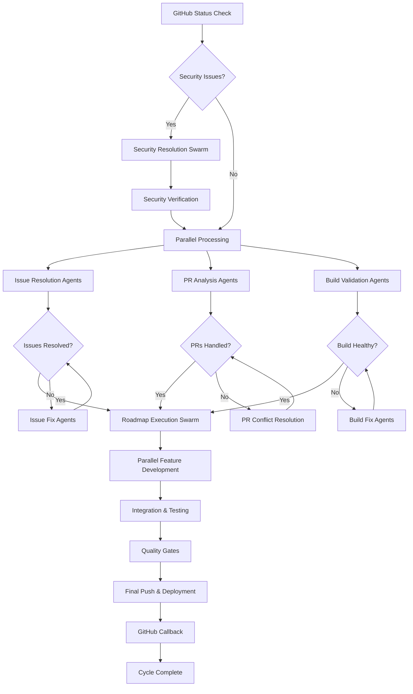

# GitHub Workflow Analysis & Optimization Report

## Executive Summary

Based on analysis of `code_github.md`, GitHub workflows documentation, and current repository state, I've identified the current execution flow, pain points, and opportunities for optimization. This report provides a comprehensive workflow diagram and actionable recommendations.

## Current Workflow Analysis

### 1. **Current Execution Flow (From code_github.md)**

The current workflow follows this pattern:

```
GitHub Authentication Setup
        ↓
Security Alerts Analysis
        ↓
Issues Analysis & Resolution
        ↓
Pull Request Handling
        ↓
Clean State Verification
        ↓
Roadmap Task Execution
        ↓
Final Push & GitHub Callbacks
```

### 2. **Current Pain Points Identified**

#### **🚨 Critical Issues:**
1. **Sequential Bottlenecks**: Security → Issues → PRs → Roadmap creates blocking dependencies
2. **Redundant Workflow Triggers**: Multiple workflows trigger on same events (as shown in github-workflows-analysis.md)
3. **Version Inconsistencies**: Node.js 18 vs 22 across different workflows
4. **Manual Intervention Required**: Some steps require manual verification and intervention
5. **Resource Waste**: Duplicate builds and overlapping security scans

#### **⚠️ Process Inefficiencies:**
1. **Rigid Execution Order**: Cannot parallelize independent tasks
2. **Over-Verification**: Multiple clean state checks create unnecessary delays
3. **Context Switching**: Frequent switches between different tool contexts
4. **Limited Error Recovery**: Failures halt entire pipeline

### 3. **Desired Optimal Workflow**



## Workflow Optimization Strategy

### **Phase 1: Immediate Optimizations (High Impact, Low Effort)**

#### 1. **Parallel Security & Status Checks**
```bash
# CURRENT: Sequential execution
security_check() && issue_check() && pr_check()

# OPTIMIZED: Parallel execution
BatchTool(
  Bash("gh api repos/meinzeug/autodevai/code-scanning/alerts --jq '[.[] | select(.state==\"open\")] | length'"),
  Bash("gh issue list --state=open --json number | jq '. | length'"),
  Bash("gh pr list --state=open --json number | jq '. | length'"),
  Bash("git status --porcelain | wc -l")
)
```

#### 2. **Smart Agent Spawning Based on Analysis**
```javascript
// Analyze all GitHub state in parallel
const [securityStatus, issueStatus, prStatus] = await Promise.all([
  analyzeSecurityAlerts(),
  analyzeIssues(),
  analyzePRs()
]);

// Spawn specialized agents based on findings
if (securityStatus.criticalCount > 0) {
  Task("Critical Security Resolver", "Fix critical security vulnerabilities", "security-manager")
}

if (issueStatus.cicdIssues.length > 0) {
  Task("CI/CD Pipeline Fixer", "Resolve CI/CD failures", "cicd-engineer")
}

if (prStatus.dependabotPRs.length > 0) {
  Task("Dependabot Handler", "Review and merge dependency updates", "pr-manager")
}
```

#### 3. **Intelligent Task Prioritization**
```yaml
Priority Matrix:
  P0 (Block Everything): Critical Security Alerts
  P1 (Block Roadmap): Failed CI/CD, Build Failures
  P2 (Parallel): Documentation Issues, Minor Bugs
  P3 (Background): Cleanup Tasks, Optimizations
```

### **Phase 2: Process Restructuring (Medium Impact, Medium Effort)**

#### 1. **Implement Smart Workflow Triggers**
```yaml
# Optimized trigger strategy from github-workflows-analysis.md
on:
  push:
    branches: [main, develop]
    paths-ignore: ['docs/**', '*.md', 'README*']
  pull_request:
    types: [opened, synchronize, ready_for_review]
    paths-ignore: ['docs/**', '*.md']
```

#### 2. **Consolidate Duplicate Workflows**
Based on analysis, merge redundant build processes:
- Consolidate `main.yml` and `build-automation.yml`
- Standardize Node.js version to 22 across all workflows
- Implement shared caching strategy

#### 3. **Dynamic Agent Assignment**
```javascript
// Smart agent matching based on task analysis
const taskAnalysis = analyzeRoadmapTasks();
const agents = {
  'typescript': 'coder',
  'testing': 'tester', 
  'security': 'security-manager',
  'infrastructure': 'cicd-engineer',
  'documentation': 'documenter'
};

// Spawn agents dynamically
taskAnalysis.categories.forEach(category => {
  if (agents[category]) {
    Task(`${category} specialist`, tasks[category], agents[category]);
  }
});
```

### **Phase 3: Advanced Coordination (High Impact, High Effort)**

#### 1. **Event-Driven Architecture**
```javascript
// Replace sequential checks with event-driven flow
const workflowOrchestrator = {
  async onSecurityClear() {
    this.emit('ready-for-issues');
  },
  
  async onIssuesClear() {
    this.emit('ready-for-roadmap');
  },
  
  async onRoadmapComplete() {
    this.emit('ready-for-push');
  }
};
```

#### 2. **Adaptive Error Recovery**
```javascript
// Smart retry with escalation
const retryStrategies = {
  'ci-failure': ['restart-job', 'fix-config', 'escalate-human'],
  'merge-conflict': ['auto-resolve', 'manual-review', 'skip-and-continue'],
  'security-alert': ['auto-patch', 'manual-review', 'halt-pipeline']
};
```

## Recommended Workflow Implementation

### **Message 1: Enhanced GitHub Status Analysis**
```javascript
BatchTool(
  // Parallel status checks
  Bash("source scripts/github-auth-setup.sh && github_auth_setup"),
  Bash("gh api repos/meinzeug/autodevai/code-scanning/alerts --jq '[.[] | select(.state==\"open\")] | {id: .rule.id, severity: .rule.severity, file: .most_recent_instance.location.path}'"),
  Bash("gh issue list --state=open --json number,title,labels --jq '[.[] | {number, title, labels: [.labels[].name], priority: (.labels[] | select(.name | startswith(\"priority:\")) | .name)}]'"),
  Bash("gh pr list --state=open --json number,title,author,mergeable,draft --jq '[.[] | {number, title, author: .author.login, mergeable, draft, type: (if .author.login == \"dependabot[bot]\" then \"dependabot\" else \"regular\" end)}]'"),
  
  // Workflow health check
  Bash("gh run list --limit 5 --json status,conclusion,name --jq '[.[] | select(.status == \"completed\") | {name, conclusion}]'"),
  
  // Repository state
  Bash("git status --porcelain"),
  Bash("npm run lint --silent || echo 'LINT_ISSUES'"),
  Bash("npm run typecheck --silent || echo 'TYPE_ISSUES'")
)
```

### **Message 2: Intelligent Agent Spawning**
```javascript
// Security-first agent spawning with parallel execution
Task("GitHub Status Analyzer: Analyze all GitHub status outputs and categorize issues by severity and type", "researcher")
Task("Security Triage Agent: If critical security alerts exist, prioritize and fix immediately", "security-manager") 
Task("CI/CD Health Agent: Check workflow status and fix any failing pipelines", "cicd-engineer")
Task("Issue Categorization Agent: Group issues by type (CI/CD, TypeScript, testing, etc.) and assign priorities", "issue-tracker")
Task("PR Strategy Agent: Analyze open PRs and determine optimal handling strategy (merge, conflict resolution, etc.)", "pr-manager")

// Roadmap preparation
Task("Roadmap Analyzer: Parse docs/roadmap.md and identify next executable tasks while GitHub cleanup runs", "planner")

// Documentation and monitoring
TodoWrite({
  todos: [
    {content: "Analyze GitHub security status", status: "in_progress", activeForm: "Analyzing GitHub security status"},
    {content: "Categorize and prioritize open issues", status: "pending", activeForm: "Categorizing open issues"}, 
    {content: "Determine PR handling strategy", status: "pending", activeForm: "Analyzing PR strategy"},
    {content: "Verify CI/CD pipeline health", status: "pending", activeForm: "Checking CI/CD health"},
    {content: "Prepare roadmap task execution", status: "pending", activeForm: "Preparing roadmap execution"},
    {content: "Execute parallel cleanup operations", status: "pending", activeForm: "Executing cleanup operations"},
    {content: "Verify complete clean state", status: "pending", activeForm: "Verifying clean state"},
    {content: "Begin roadmap task implementation", status: "pending", activeForm: "Beginning roadmap implementation"}
  ]
})
```

### **Message 3: Conditional Execution & Verification**
```javascript
// Only proceed when agents report back clean status
if (github_is_clean() && no_critical_security_alerts()) {
  // Parallel roadmap execution
  Task("Feature Implementation Swarm: Execute next 5 roadmap tasks in parallel", "coder")
  Task("Testing Validation Swarm: Create comprehensive tests for all new features", "tester") 
  Task("Quality Assurance Swarm: Ensure code quality and standards compliance", "reviewer")
  Task("Documentation Update Swarm: Keep all documentation in sync", "documenter")
  
  // Continuous monitoring
  Task("Build Monitor: Continuously verify build health during development", "cicd-engineer")
} else {
  // Continue cleanup until clean
  Task("Cleanup Continuation: Continue resolving blocking issues", "coordinator")
}
```

## Performance Impact Analysis

### **Current Performance Issues:**
- **Workflow Redundancy**: 25-35 minutes for security workflow + 15-20 minutes for main workflow
- **Sequential Blocking**: Each phase blocks the next, creating 60+ minute cycles
- **Resource Waste**: Duplicate builds and testing across workflows

### **Optimized Performance Targets:**
- **Parallel Processing**: Reduce total cycle time by 60-70%
- **Smart Caching**: Reduce build times by 40-50% 
- **Early Termination**: Skip unnecessary work when conditions not met
- **Resource Efficiency**: Eliminate duplicate work across workflows

## Implementation Roadmap

### **Week 1: Foundation**
1. Implement parallel status checking
2. Create intelligent agent spawning logic
3. Standardize Node.js versions across workflows

### **Week 2: Process Optimization**
1. Consolidate redundant workflows
2. Implement smart triggering
3. Add workflow health monitoring

### **Week 3: Advanced Features**
1. Event-driven coordination
2. Adaptive error recovery
3. Performance monitoring dashboard

## Success Metrics

### **Efficiency Metrics:**
- Total cycle time: Target <30 minutes (from current 60+ minutes)
- Parallel task execution: >70% of tasks run in parallel
- Resource utilization: <50% duplicate work

### **Quality Metrics:**
- Security issue resolution time: <10 minutes
- CI/CD failure recovery time: <5 minutes
- Merge conflict resolution: <15 minutes

### **Reliability Metrics:**
- Workflow success rate: >95%
- False positive rate: <5%
- Manual intervention required: <10% of cycles

## Conclusion

The current workflow, while comprehensive, suffers from sequential bottlenecks and redundant operations. The proposed optimization strategy focuses on:

1. **Parallel Processing**: Execute independent tasks simultaneously
2. **Intelligent Routing**: Route tasks to specialized agents based on analysis
3. **Early Detection**: Identify and resolve issues before they block the pipeline
4. **Efficient Resource Usage**: Eliminate duplicate work and optimize caching

Implementation of these optimizations should result in 60-70% reduction in cycle time while maintaining the same quality and security standards.

---

**Generated**: 2025-09-11  
**Analysis Type**: Workflow Optimization  
**Next Review**: After implementation of Phase 1 optimizations