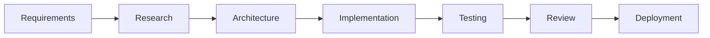

# AutoDev-AI Comprehensive Testing Strategy

## Executive Summary

This document outlines the comprehensive testing strategy for the AutoDev-AI Neural Bridge Platform, addressing current testing gaps and providing a robust framework for performance, security, integration, and end-to-end testing.

## Current Testing Analysis

### Existing Test Coverage
1. **Integration Testing**: Basic OpenRouter, Claude-Flow, and Codex integration (892 lines)
2. **Performance Testing**: Performance benchmarks, load testing, stress testing, memory leak detection
3. **Security Testing**: API security, container security, penetration testing, compliance monitoring
4. **Unit Testing**: Minimal coverage identified

### Critical Testing Gaps Identified
1. **Missing Unit Test Coverage**: Limited unit tests for core components
2. **Incomplete E2E Workflow Testing**: No comprehensive workflow validation
3. **Insufficient Cross-Agent Communication Testing**: Swarm coordination testing gaps
4. **Limited Test Data Management**: No centralized test data strategy
5. **Missing CI/CD Test Integration**: No automated testing pipeline
6. **Inadequate Performance Baseline Testing**: No systematic performance regression detection

## Performance Benchmark Test Framework

### Architecture Overview
```
Performance Testing Framework
├── Benchmark Engine (Core)
├── Load Testing Orchestrator
├── Stress Testing Controller
├── Memory Monitoring System
├── Response Time Analyzer
├── Bottleneck Detection
└── Performance Regression Detection
```

### Key Components

#### 1. Benchmark Engine
- **Purpose**: Execute standardized performance benchmarks
- **Metrics**: Throughput, latency, resource utilization
- **Tools**: Jest with custom performance matchers, Artillery.js, K6
- **Baseline**: Establish performance baselines for all critical operations

#### 2. Load Testing Strategy
- **Service Load Testing**: OpenRouter API, Claude-Flow orchestration, Docker sandboxes
- **Concurrent User Simulation**: 10-1000 concurrent users
- **Gradual Load Increase**: Ramp-up testing from 10% to 150% capacity
- **Spike Testing**: Sudden load increases to test resilience

#### 3. Stress Testing Implementation
- **Resource Exhaustion**: CPU, memory, network bandwidth testing
- **Service Degradation**: Graceful degradation under extreme load
- **Recovery Testing**: System recovery after stress events
- **Chaos Engineering**: Random service failures and network partitions

### Performance Test Categories

#### Micro-Benchmarks
- Individual function performance
- Algorithm complexity validation
- Memory allocation patterns
- Database query optimization

#### Component Benchmarks
- Service response times
- API endpoint performance
- Docker container startup times
- Agent spawning performance

#### System Benchmarks
- End-to-end workflow performance
- Cross-service communication latency
- Resource scaling behavior
- Throughput under load

## Load Testing Implementation Plan

### Test Scenarios

#### 1. API Load Testing
```javascript
// OpenRouter API Load Test
const loadTestConfig = {
  target: 'https://openrouter.ai/api/v1',
  phases: [
    { duration: '2m', arrivalRate: 10 }, // Warm-up
    { duration: '5m', arrivalRate: 50 }, // Normal load
    { duration: '2m', arrivalRate: 100 }, // Peak load
    { duration: '5m', arrivalRate: 50 }, // Cool down
  ],
  scenarios: {
    completion: { weight: 70 },
    modelSelection: { weight: 20 },
    healthCheck: { weight: 10 }
  }
};
```

#### 2. Swarm Orchestration Load Testing
- Multiple swarm initialization
- Concurrent agent spawning
- Task orchestration under load
- Memory coordination stress testing

#### 3. Docker Sandbox Load Testing
- Concurrent sandbox creation
- Resource allocation testing
- Container lifecycle management
- Network performance under load

### Load Testing Tools Integration
- **Artillery.js**: HTTP/WebSocket load testing
- **K6**: Advanced performance testing
- **JMeter**: GUI-based load testing
- **Custom Jest Matchers**: Application-specific testing

## Security Testing Framework Structure

### Security Testing Architecture
```
Security Testing Framework
├── Vulnerability Scanning
├── Penetration Testing Automation
├── Compliance Validation
├── Threat Modeling
├── Security Incident Simulation
└── Continuous Security Monitoring
```

### Security Test Categories

#### 1. API Security Testing
- Authentication bypass attempts
- Authorization privilege escalation
- Input validation and injection attacks
- Rate limiting and DDoS protection
- OpenRouter API key security

#### 2. Container Security Testing
- Image vulnerability scanning (Trivy)
- Runtime security monitoring
- Container escape attempts
- Network isolation validation
- Secrets management testing

#### 3. Compliance Testing
- **OWASP ASVS 4.0**: Application Security Verification Standard
- **NIST Cybersecurity Framework**: Comprehensive security controls
- **ISO 27001**: Information security management
- **SOC 2 Type II**: Security and availability controls

#### 4. Penetration Testing Automation
- OWASP ZAP integration
- Custom exploit development
- Business logic testing
- Session management testing
- Cross-site scripting (XSS) protection

### Security Testing Implementation
```javascript
// Security Test Suite Structure
const securityTestSuite = {
  apiSecurity: {
    authentication: ['jwt-validation', 'session-management'],
    authorization: ['rbac-testing', 'privilege-escalation'],
    inputValidation: ['sql-injection', 'xss-protection', 'command-injection']
  },
  containerSecurity: {
    imageScanning: ['vulnerability-detection', 'malware-scanning'],
    runtimeSecurity: ['container-escape', 'privilege-escalation'],
    networkSecurity: ['port-scanning', 'traffic-analysis']
  },
  complianceValidation: {
    owaspAsvs: ['v4.0-controls', 'verification-requirements'],
    nistCsf: ['identify', 'protect', 'detect', 'respond', 'recover'],
    iso27001: ['security-controls', 'risk-management']
  }
};
```

## Integration Testing Coordination

### Cross-Service Integration Testing
1. **OpenRouter ↔ Claude-Flow Integration**
   - Model selection optimization
   - Fallback mechanism testing
   - Cost estimation accuracy
   - Performance metrics collection

2. **Claude-Flow ↔ Swarm Coordination**
   - Agent spawning coordination
   - Task distribution algorithms
   - Memory sharing mechanisms
   - Hook execution validation

3. **Codex ↔ Quality Assurance**
   - Code generation quality
   - Analysis accuracy validation
   - Optimization effectiveness
   - Debug capability testing

### Agent Communication Testing
```javascript
// Inter-Agent Communication Test
const agentCommunicationTest = {
  scenarios: [
    'researcher-to-coder-handoff',
    'architect-to-team-broadcast',
    'tester-to-reviewer-feedback',
    'coordinator-to-all-orchestration'
  ],
  validation: [
    'message-delivery-guarantee',
    'ordering-preservation',
    'failure-recovery',
    'performance-under-load'
  ]
};
```

## End-to-End Testing Framework

### E2E Test Scenarios

#### 1. Complete Development Workflow


#### 2. Critical User Journeys
- Project initialization to completion
- Emergency incident response
- Performance optimization workflow
- Security vulnerability remediation

#### 3. Error Recovery Testing
- Service failure scenarios
- Network partition handling
- Data corruption recovery
- Agent failure resilience

### E2E Testing Tools
- **Playwright**: Browser automation for web interfaces
- **Puppeteer**: Chrome DevTools Protocol automation
- **Cypress**: Modern E2E testing framework
- **Custom Orchestration**: Swarm-based E2E testing

## Test Data Management Strategy

### Test Data Architecture
```
Test Data Management
├── Data Factories
├── Mock Services
├── Fixture Management
├── Environment Isolation
├── Data Privacy Protection
└── Performance Datasets
```

### Implementation Strategy

#### 1. Data Factories
```javascript
// Test Data Factory Pattern
class TestDataFactory {
  static createUser(overrides = {}) {
    return {
      id: uuid(),
      name: faker.name.findName(),
      email: faker.internet.email(),
      apiKey: this.generateTestApiKey(),
      permissions: ['basic'],
      ...overrides
    };
  }
  
  static createSwarmConfig(overrides = {}) {
    return {
      topology: 'mesh',
      maxAgents: 8,
      strategy: 'balanced',
      ...overrides
    };
  }
}
```

#### 2. Mock Services
- OpenRouter API mock server
- Docker daemon simulation
- Database connection mocking
- Network condition simulation

#### 3. Environment Isolation
- Containerized test environments
- Database seeding and cleanup
- Service port allocation
- Resource isolation

## CI/CD Integration Strategy

### Automated Testing Pipeline
```yaml
# Testing Pipeline Structure
stages:
  - unit-tests
  - integration-tests
  - security-tests
  - performance-tests
  - e2e-tests
  - deployment-tests

quality-gates:
  - code-coverage: 85%
  - security-scan: passing
  - performance-regression: none
  - e2e-success: 100%
```

### Test Execution Strategy
1. **Parallel Execution**: Unit and integration tests
2. **Sequential Execution**: E2E and performance tests
3. **Conditional Execution**: Security tests on code changes
4. **Smoke Tests**: Quick validation after deployment

### Quality Metrics and Reporting
- Test coverage reports
- Performance trend analysis
- Security vulnerability tracking
- Failure rate monitoring

## Test Automation Framework

### Framework Architecture
```
Test Automation Framework
├── Test Orchestration Engine
├── Parallel Execution Manager
├── Result Aggregation System
├── Reporting Dashboard
├── Alert System
└── Metrics Collection
```

### Key Features

#### 1. Intelligent Test Selection
- Change-based test execution
- Risk-based test prioritization
- Flaky test detection and isolation
- Historical data analysis

#### 2. Dynamic Environment Management
- On-demand test environment creation
- Resource optimization
- Environment cleanup automation
- Configuration management

#### 3. Advanced Reporting
- Real-time test results
- Performance trend visualization
- Security compliance dashboard
- Failure analysis and recommendations

## Implementation Roadmap

### Phase 1: Foundation (Weeks 1-2)
- Establish unit testing framework
- Implement basic performance benchmarks
- Setup CI/CD pipeline integration
- Create test data management system

### Phase 2: Advanced Testing (Weeks 3-4)
- Implement comprehensive security testing
- Deploy load testing infrastructure
- Create E2E testing framework
- Establish monitoring and alerting

### Phase 3: Optimization (Weeks 5-6)
- Performance regression detection
- Test automation optimization
- Advanced reporting implementation
- Documentation and training

### Phase 4: Continuous Improvement (Ongoing)
- Test effectiveness analysis
- Framework optimization
- Tool integration improvements
- Team training and adoption

## Success Metrics

### Key Performance Indicators
- **Test Coverage**: Target 90% code coverage
- **Test Execution Time**: <30 minutes for full suite
- **Failure Detection Rate**: 95% of bugs caught in testing
- **Security Coverage**: 100% OWASP ASVS compliance
- **Performance Baseline**: <2% performance regression tolerance

### Quality Metrics
- Defect escape rate
- Test automation percentage
- Mean time to feedback
- Test maintenance overhead
- Security vulnerability detection rate

## Risk Mitigation

### Testing Risks and Mitigation Strategies
1. **Flaky Tests**: Implement retry mechanisms and test isolation
2. **Test Data Corruption**: Automated data cleanup and restoration
3. **Environment Instability**: Containerized and isolated test environments
4. **Performance Test Variability**: Multiple test runs and statistical analysis
5. **Security Test False Positives**: Manual verification and tuning

## Conclusion

This comprehensive testing strategy provides a robust foundation for ensuring the quality, security, and performance of the AutoDev-AI Neural Bridge Platform. The framework emphasizes automation, parallel execution, comprehensive coverage, and continuous improvement to support the platform's complex distributed architecture and AI-driven workflows.

The implementation will be executed in phases, with immediate focus on filling critical testing gaps while building toward a fully automated, intelligent testing ecosystem that provides rapid feedback and high confidence in system reliability.